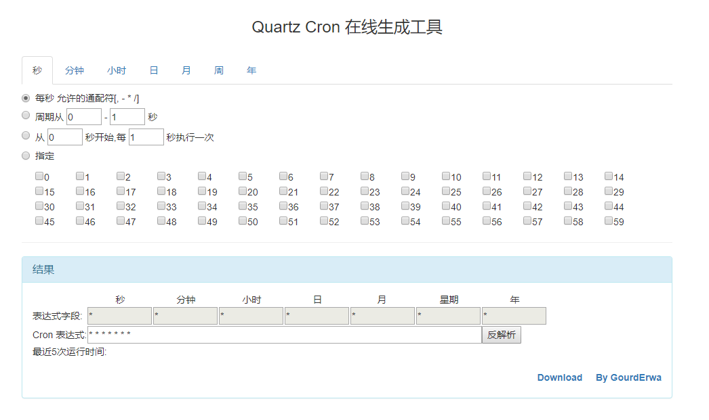

# :sparkles: :heart: QuartzCronUtil :heart: :sparkles:   

## Introduction
[QuartzCronUtil 在线使用](http://gourderwa.com/quartzcron/index.html)

## Environment

## Reference
- @see pom.xml

## About me
- WebSite：[http://www.gourderwa.com](http://www.gourderwa.com)
- Email：  [gourderwa@163.com](gourderwa@163.com)
- GitHub： [https://github.com/GourdErwa](https://github.com/GourdErwa)
- Blog：   [GourdErwa](http://blog.csdn.net/xiaohulunb)
- WeiBo：  [@GourdErwa](http://www.weibo.com/xiaohulunb)

## Copyright and License
**The MIT License (MIT)**  
